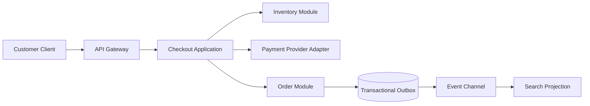

# Architecture Diagrams And Decision Records

Architecture communication should make decisions easier to challenge. A polished diagram does not prove the architecture works. Useful diagrams show boundaries, data flow, dependencies, failure modes, and open questions.

## Diagram Types

Context diagrams show users, external systems, and the system being designed.

Container diagrams show deployable or executable units such as web apps, backend services, workers, databases, caches, queues, search indexes, and third-party providers.

Component diagrams show important modules inside a container, such as controllers, use cases, domain services, repositories, adapters, and event publishers.

Sequence diagrams show request or event flow over time. They are useful for checkout, retries, sagas, compensation, and failover decisions.

Data-flow diagrams show how sensitive data moves across trust boundaries. They are useful for privacy and threat modelling.

Deployment diagrams show runtime placement, zones, regions, routing, and dependencies.

State diagrams show valid transitions, invalid transitions, pending states, retries, and compensation states.

Threat models show assets, trust boundaries, attacker goals, abuse paths, mitigations, and residual risks.

## Example Container Diagram

This diagram communicates a possible flow. It does not prove latency, correctness, security, or production readiness. The decision record must still explain assumptions, alternatives, and validation.

## ADR Structure

An architecture decision record should include:

- title
- status
- date
- context
- decision
- alternatives considered
- consequences
- risks
- assumptions
- reversibility
- review or expiry date
- validation plan

## Decision Quality

A useful decision avoids universal claims. Instead of "use microservices because they scale", write "split catalogue search from checkout because search read volume and index refresh needs differ from checkout correctness needs; keep inventory reservation inside a strongly consistent boundary until contention evidence supports another design."

## Fitness Functions

Architecture fitness functions are automated or repeatable checks that protect decisions. Examples:

- Java package dependency checks prevent modules from importing hidden internals
- API contract checks reject incompatible field removals
- retry policy checks reject unbounded retries on non-idempotent writes
- security-boundary checks require authorization decisions before sensitive operations
- SLO checks ensure dashboards and alerts exist for critical user journeys

Fitness checks reduce drift. They do not replace production telemetry, incident learning, code review, or performance testing.

## Review Checklist

- Does every diagram have a purpose?
- Are trust boundaries and data owners visible?
- Are synchronous dependencies and fan-out risks visible?
- Are asynchronous paths explicit about retries, idempotency, ordering, and dead letters?
- Are alternatives and rejected options documented?
- Are assumptions measurable?
- Are risks owned?
- Is there a validation plan?
- Is the design honest about what remains unknown?
