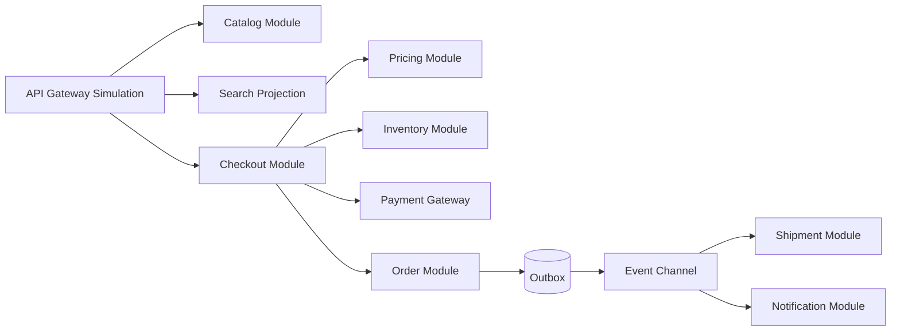

# Architecture Overview

The default architecture is a modular commerce backend with clear module boundaries and simulated ports. Catalogue owns product facts. Search owns derived projections. Pricing owns price decisions. Inventory owns reservations. Cart owns customer intent before checkout. Checkout coordinates the saga. Payment owns provider idempotency. Orders own confirmed lifecycle state. Shipment and notification react to events. Identity and administration define trust boundaries.

