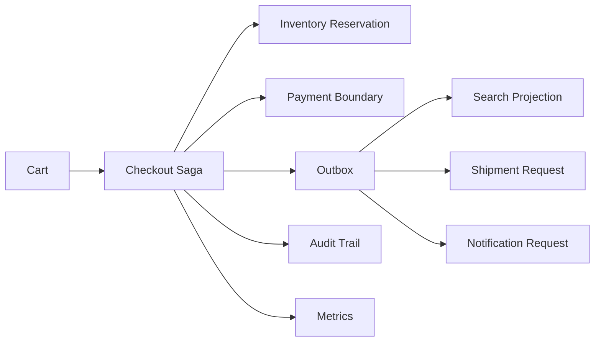

# Architecture Overview

The system is organized as a modular monolith simulation with explicit boundaries for catalogue, pricing, inventory, checkout, payment, messaging, search, observability, and operations.

