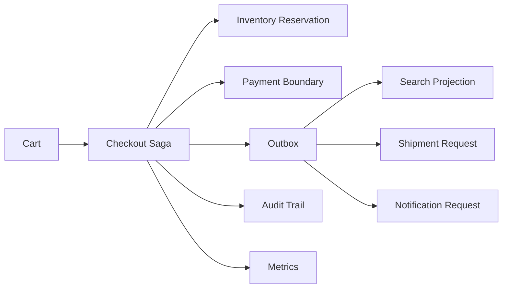

# Architecture Overview

The system is organized as a modular monolith simulation with explicit boundaries for catalogue, pricing, inventory, checkout, payment, messaging, search, observability, and operations.

## Purpose

The architecture is meant to show how a commerce backend can coordinate several business capabilities without turning every concept into a separate deployable service. A modular monolith keeps the capstone runnable with `mvn test` while still forcing boundary decisions: checkout coordinates the workflow, inventory owns reservation state, payment owns idempotent charge results, and messaging owns delivery simulation.

## Assumptions And Constraints

- The system runs in one JVM and stores state in memory.
- External dependencies are represented by explicit boundaries, not real network calls.
- Tests use deterministic clocks and identifiers where the scenario needs repeatable evidence.
- Default validation must not require a database, message broker, Docker, cloud account, or network.

These constraints make the project reviewable and portable. They also mean that the architecture demonstrates reasoning rather than operational durability.

## Trade-Offs

Keeping the implementation in one Maven module reduces setup friction and makes scenario tests easy to follow. The cost is that process boundaries, independent scaling, deployment ownership, and real data stores are not exercised. A production design might split catalogue, inventory, checkout, payment, fulfillment, and notification into separate services or modules, but doing that here would add infrastructure ceremony without improving the learning signal.

## Alternative Approaches

- A layered CRUD service would be simpler, but it would hide saga, outbox, projection, and compensation decisions.
- A microservice simulation would make boundaries visually obvious, but most tests would become transport and fixture management instead of domain reasoning.
- A Spring Boot API would show HTTP contracts, but the capstone focuses on backend behavior and failure paths rather than framework wiring.

## Production Comparison

In production, every in-memory boundary would need a durable implementation: transactional inventory storage, persisted idempotency keys, payment provider reconciliation, an outbox relay, broker-backed consumers, searchable projections, audit retention, and operational dashboards. This capstone is intentionally smaller: it makes the decisions visible and testable without claiming those production properties.
